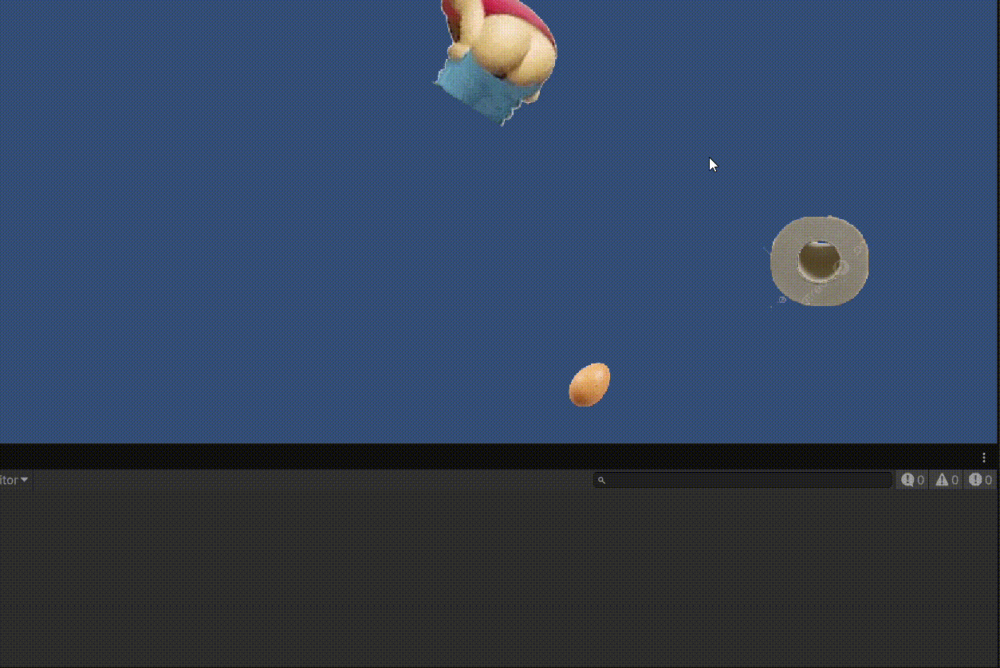

# Opdracht 1A: Array

## als je op ENTER drukt print hij een willekeurig getal en als je op ESC drukt dan print hij alle getallen.

### https://github.com/panter53/Game-Development-M2/blob/main/Assets/arrays.cs

# Opdracht 2.1: Forces & collision

## Ik heb een connon gemaakt met een schietlijn en als peggles wc rolletjes, als bal een eitje en als je de peggle raakt krijg je 200 punten.

